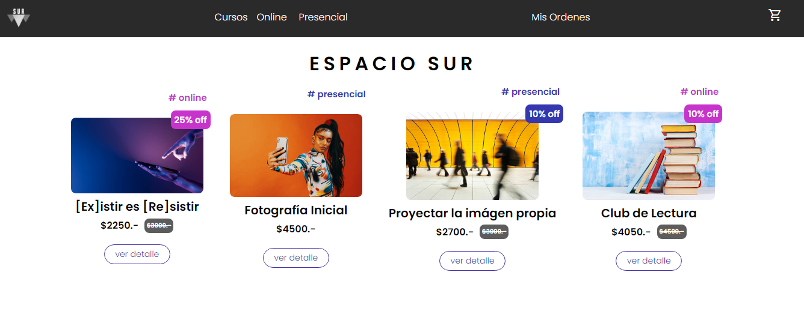
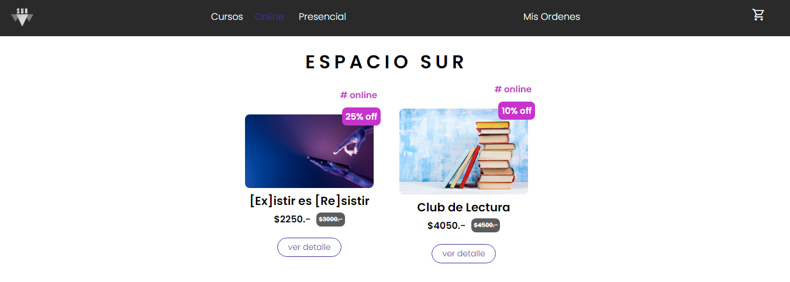
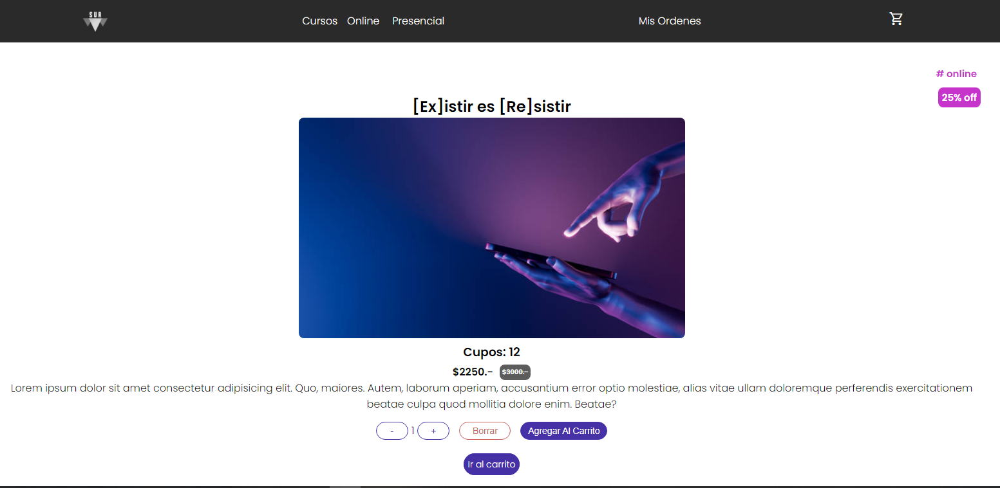
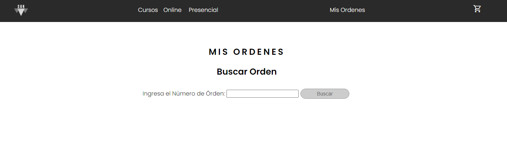

# E S P A C I O S U R

Espacio Sur es un proyecto E-Commerce de venta de Cursos On-line, realizado en React Js y como servidor se utilizó Firebase.
Algunos de los títulos de los cursos fueron tomados de plataformas reales, los mismos fueron tomados como referencia para la realización del proyecto.

# Funcionalidades del Proyecto - Usuario

- Mediante el sitio se pueden visualizar los cursos que hay disponibles para inscribirse en Espacio Sur.
- Se pueden filtrar los cursos, según la modalidad del curso (Presencial / Online).
- A simple vista, se puede observar en cada uno de ellos, una imágen ilustrativa, el titulo, el descuento disponible, la modalidad de cursado y el precio.
- A través del botón ver detalle, se puede acceder al contenido de cada curso, que en este momento es ficticio. El usuario puede seleccionar la cantidad de cupos a comprar y agregarlos al carrito de compras.
- En el carrito de compras, se podrá:
  - visualizar un resumen de compra.
  - eliminar los productos.
  - vaciar el carrito, en caso de arrepentirse de la compra.
  - así como también, ir al checkout para finalizar el pedido.
- Para poder finalizar la compra, es necesario completar un formulario de contacto con los datos personales del Usuario, mediante el cual se le mostrará en pantalla un código de seguimiento de la órden.
- Se podrá consultar la Órden de compra una vez realizada la compra.

# Visualización del proyecto

### Home



### Modalidades



### Detalle del Curso



### Carrito de productos


### Buscador - Mis Ordenes



# Funcionalidades del Proyecto - Base de Datos

- Posee Modalidades Dinámicas, es decir que si se agrega una nueva modalidad en la base de datos, la misma se verá reflejada en el menú de navegación de forma automática.
- Posee Productos Dinámicos, es decir que si se agrega un nuevo producto en la base de datos, el mismo se verá reflejado en la lista de productos, así como también se agregará al filtro de categorías.

# Librerías Utilizadas

- [React Js](https://es.reactjs.org/).
  React Js: Una biblioteca de JavaScript para construir interfaces de usuario, es de código abierto y su objetivo es facilitar el desarrollo de aplicaciones en una sola página.

- [Node Js](https://nodejs.org/en/) Node. js es un entorno de ejecución de JavaScript, basado en una arquitectura no bloqueante y manejada por eventos para ayudar a los desarrolladores a crear aplicaciones distribuidas robustas. De código abierto y multiplataforma, se emplea para desarrollar aplicaciones de servidor.

- [Node Package Manager - NPM](https://www.npmjs.com/)
  Es el gestor de paquetes, módulos o librerías que nos proporciona Node.js

- [React-Router-Dom](https://reactrouter.com/en/main) es una librería que se utiliza bastante con React y que nos facilita el proceso de definir las rutas de navegación dentro de nuestra aplicación.

  ```bash
  npm install react-router-dom
  ```

- [Firebase](https://firebase.google.com/) es una plataforma para el desarrollo de aplicaciones web y aplicaciones móviles lanzada en 2011 y adquirida por Google en 2014.

  ```bash
  npm install firebase
  ```

- [React-spinners](https://www.npmjs.com/package/react-spinners) Es una libreria de React que proporciona un componente SVG que se puede implementar para la operación de espera asíncrona antes de que los datos se carguen en la vista del usuario.

  ```bash
  npm install --save react-spinners
  ```

- [React-toastify]() es una librería que te permite añadir notificaciones de una forma muy facil, las mismas se pueden personalizar en estilo y mensaje que le muestra al usuario.

  ```bash
  npm install --save react-toastify
  ```

- [GitHub](https://github.com/) GitHub es un servicio basado en la nube que aloja un sistema de control de versiones (VCS) llamado Git. Éste permite a los desarrolladores colaborar y realizar cambios en proyectos compartidos, a la vez que mantienen un seguimiento detallado de su progreso.

- [Material Icons](https://fonts.google.com/icons) Permite agregar iconos a tu sitio web en HTML es utilizando los icons fonts material de Google, sin agregar mas archivos a tu sitio.

# Ejecutar el proyecto desde un editor de código:

- Ejecutar el proyecto en la consola del editor de código:
  ```bash
  npm start
  ```

# Empezando con React - Create React App

Este proyecto fue creado con [Create React App](https://github.com/facebook/create-react-app).

## Clonar repositorio de forma local

- Clonar el repositorio: git clone [Link al Repositorio](https://github.com/ccpappalardo/espacio_sur)

- Instalar las dependencias:
  ```bash
  npm install
  ```

## Scripts Disponibles

- En el directorio del proyecto, puedes ejecutar:

  ```bash
  npm start
  ```

Este comando corre la aplicación en modo desarrollador.\
Abri tu navegador en [http://localhost:3000](http://localhost:3000) para ver el proyecto.

El sitio se recargará cuando hagas cambios....

## Aprender más sobre React - Create React App

Puedes aprender más en la [Documentación de Create React App](https://facebook.github.io/create-react-app/docs/getting-started).

Para aprender React puedes chequear la [Documentación de React](https://reactjs.org/).
